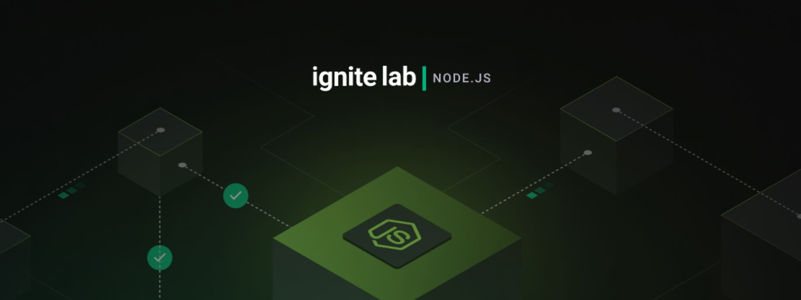

# Rocketseat Ignite Lab: Nodejs

O projeto foi desenvolvido durante o ultimo ignite lab de 2022, que ocorreu entre os dias 12 - 16 de dezembro.
** em construção

  

---

## Resumo aulas

<a href="https://florentine-triangle-496.notion.site/Ignite-Lab-Node-JS-549b789008a54411ba5f75ff07105f38">Notion</a>

## ✨ O projeto

Em construção

 

## ⚙️ Instalação

### 📋 Pré-requisitos

Em construção

Feito com ❤️ por [Gustavo Sorati](https://github.com/gustavosorati) 